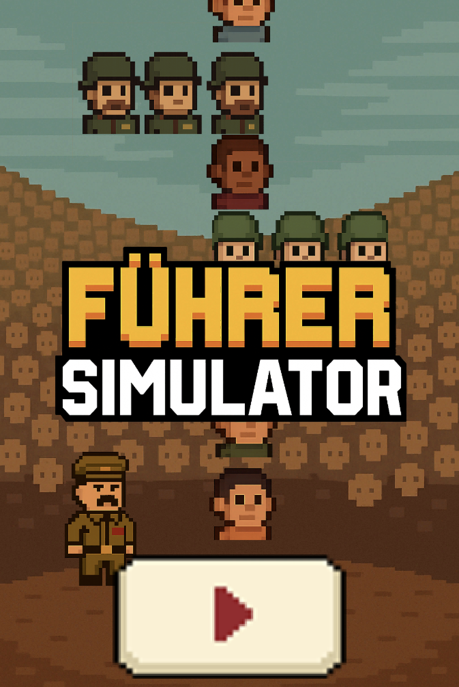

# Führer Simulator

**Führer Simulator** is a simple Unity game built with C#. This game is purely fictional and intended for entertainment purposes only.

## 🖼️ Screenshot

  

> ⚠️ **Disclaimer**  
> This project **does not** support, promote, or glorify Nazism or any hateful ideology.  
> The name and theme are used in a satirical, non-political context. Please treat it as a parody and not a statement.

## 🎮 About the Game

Führer Simulator is a light-hearted, comedic simulation game where you take control of a fictional dictator and make absurd, over-the-top decisions. It's a sandbox of chaos and satire, not history.

## 🛠️ Built With

- [Unity](https://unity.com/) (Game Engine)
- C# (Scripting Language)
- Unity UI system

## 📦 Features

- Simple click/decision-based mechanics
- No historical accuracy intended

## 🚫 Important Notes

- This game is **not** educational.
- It contains satirical political content and may not be suitable for all audiences.
- It is not affiliated with or endorsed by any political movement or ideology.